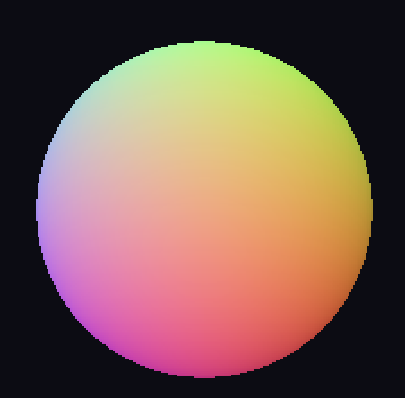
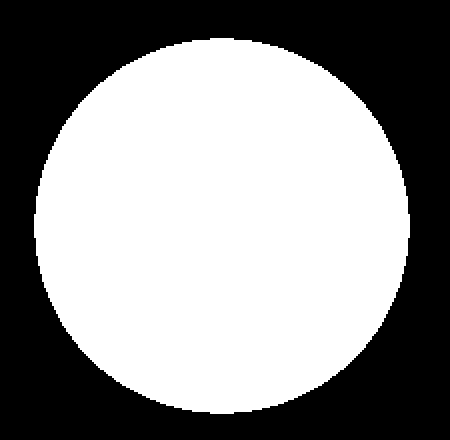
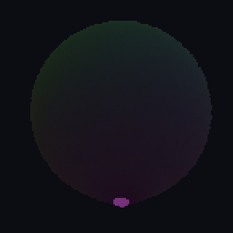
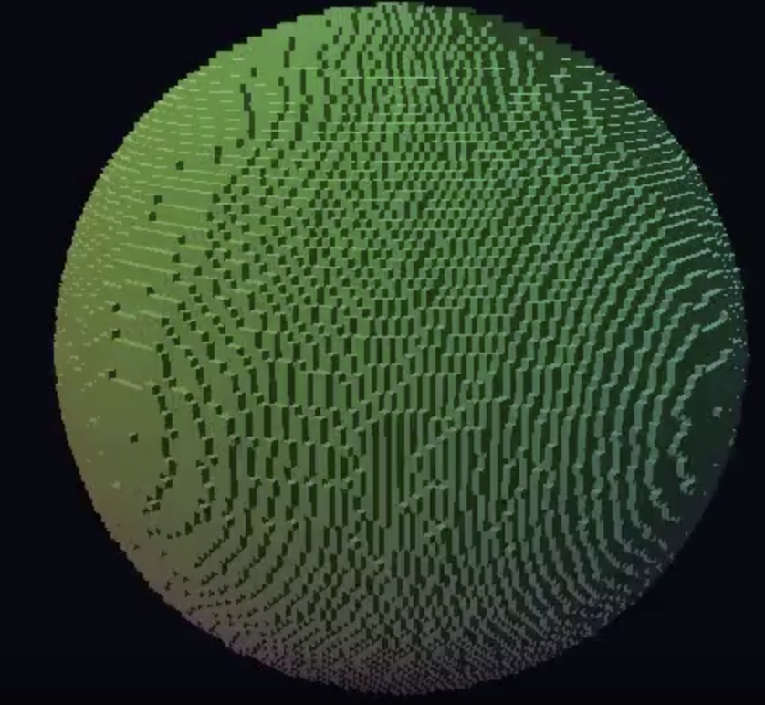

# Voxel-Rasterizer

GPU-accelerated multi-view voxel reconstruction and rasterization. Given calibrated
RGB images and foreground masks, the pipeline builds a 3D occupancy + color grid via
shape-from-silhouette, then ray-marches novel views. Both stages ship as CPU
reference implementations and matching CUDA kernels.

---

## Final Project Submission

This repository contains the complete CPU and GPU code paths, benchmark tests with
JSON metrics, and the documentation below.

### 1. Installation and Usage Instructions

#### Prerequisites

| Tool | Required for |
| --- | --- |
| CMake ≥ 3.16, C++17 compiler | Build |
| NVIDIA CUDA Toolkit (optional) | GPU paths (`--gpu`, benchmark tests) |
| netpbm (`pnmtopng`, `pngtopnm`, …) | PPM/PGM ↔ PNG conversion, photo pipeline |
| ffmpeg | Orbit MP4 export |
| Python 3 | Local web viewer (`python3 -m http.server`) |
| `rembg` (`pip install rembg`) | Auto-masking in the photo pipeline |

The build degrades gracefully to CPU-only when no CUDA toolkit is present.

#### Build

```bash
cmake -S . -B build -DCMAKE_BUILD_TYPE=Release
cmake --build build -j
ctest --test-dir build --output-on-failure
```

#### Repository layout

```
include/voxr/    Public headers
src/             CPU library + CUDA kernels (.cu)
apps/            CLI tools
scripts/         Pipeline drivers
tests/           CPU vs GPU benchmark binaries (ctest)
docs/            Screenshots and submission assets
data/            Generated datasets (git-ignored)
```

#### CLI tools

| Binary | Purpose |
| --- | --- |
| `synth_dataset` | Render an analytic shape (sphere/cube/dumbbell) from a ring of cameras → RGB + masks + `cameras.txt`. |
| `reconstruct` | Shape-from-silhouette → voxel grid. `--gpu` for the CUDA kernel. |
| `render` | Render a voxel grid to PPM (single view or orbit). `--gpu` for the CUDA ray-marcher. |
| `bake_views` | Pre-render an azimuth × elevation × radius grid + self-contained HTML viewer (drag = orbit, scroll = zoom). `--gpu` renders the frames with the resident CUDA loop. |
| `make_orbit_cameras` | Write `cameras.txt` for a folder of ring-orbit photos. |

#### Quick start (synthetic sphere)

```bash
build/synth_dataset --out data/sphere --shape sphere --views 24 --res 256 256
build/reconstruct  --in data/sphere --out data/sphere/voxels.bin --grid 128
build/render       --voxels data/sphere/voxels.bin --out data/sphere/novel.ppm \
                   --eye 1.6 1.0 1.6 --target 0 0 0 --up 0 1 0 --res 512 512

# Orbit + mp4 (needs netpbm + ffmpeg)
build/render --voxels data/sphere/voxels.bin --orbit data/sphere/orbit \
             --views 36 --radius 3 --res 512 512
for f in data/sphere/orbit/*.ppm; do pnmtopng "$f" > "${f%.ppm}.png"; done
ffmpeg -y -framerate 24 -i data/sphere/orbit/frame_%04d.png \
       -c:v libx264 -pix_fmt yuv420p data/sphere/orbit.mp4

# Interactive viewer
build/bake_views --voxels data/sphere/voxels.bin --out data/sphere/view
cd data/sphere/view && python3 -m http.server 8000
# open http://localhost:8000/viewer.html
```

Swap `--shape cube` or `--shape dumbbell` to test the visual hull on concavity.

#### GPU usage

Append `--gpu` to `reconstruct` or `render` — same flags, same output. Layout
matches the strategy notes in [src/reconstruct_cpu.cpp](src/reconstruct_cpu.cpp) and
[src/render_cpu.cpp](src/render_cpu.cpp): reconstruction is one thread per voxel
(`8×8×8` blocks), rendering is one thread per pixel (`16×16` tiles).

```bash
build/reconstruct --in data/sphere --out data/sphere/voxels.bin --grid 256 --gpu
build/render      --voxels data/sphere/voxels.bin --out novel.ppm \
                  --eye 1.6 1.0 1.6 --res 1024 1024 --gpu
```

For multi-frame work the GPU renderer is **grid-resident**: orbits and the
interactive viewer upload the voxel grid to the device once, then every frame is
just a kernel launch + readback.

```bash
build/render --voxels data/sphere/voxels.bin --orbit out --views 36 --gpu
build/render --voxels data/sphere/voxels.bin --bench 200   # isolated GPU timings
build/bake_views --voxels data/sphere/voxels.bin --out view --gpu
```

#### Your own photos

[`scripts/photos_to_voxels.sh`](scripts/photos_to_voxels.sh) drives the full
pipeline: auto-converts PNG/JPG/PPM, masks via `rembg`, writes cameras,
reconstructs, bakes the viewer.

```bash
scripts/photos_to_voxels.sh ~/photos/bottle data/bottle \
    -- --radius 5.0 --fov 1.2 --elev 0

cd data/bottle/view && python3 -m http.server 8000
```

#### File formats

- **PPM** (`P6`, 8-bit RGB) for color, **PGM** (`P5`, 8-bit; ≥128 = foreground)
  for masks.
- **`cameras.txt`** — intrinsics + `t` + `R` per camera. Schema in
  [include/voxr/camera.hpp](include/voxr/camera.hpp).
- **`*.bin`** — `VOXG` magic, version 1, little-endian: dims, origin,
  voxel_size, then 4 uint8 channels (occupancy, r, g, b) in
  `idx = x + nx*(y + ny*z)` order. Layout in
  [include/voxr/voxel_grid.hpp](include/voxr/voxel_grid.hpp).

#### Conventions

OpenCV-style camera: +X right, +Y down, +Z forward, right-handed.
World right-handed, +Y up by default. Projection is
`pixel = K · R · (X_world − t_world)` divided by `z_cam`.

#### Running benchmarks

Three ctest benchmarks compare CPU vs GPU wall time. Each prints detailed metrics
to **stderr**, a one-line summary to **stdout**, and writes JSON under
`build/test_artifacts/metrics/`.

| Test | What it measures | JSON output |
| --- | --- | --- |
| [`test_bench_reconstruct`](tests/test_bench_reconstruct.cpp) | `reconstruct_cpu` vs `reconstruct_cuda` | `bench_reconstruct.json` |
| [`test_bench_render`](tests/test_bench_render.cpp) | `render_cpu` vs `render_cuda` (+ upload/kernel/readback) | `bench_render.json` |
| [`test_bench_pipeline`](tests/test_bench_pipeline.cpp) | Reconstruct + render end-to-end | `bench_pipeline.json` |

Defaults: 128³ grid, 24 views, 128² synth images, 512² render. Override via env
vars: `VOXR_BENCH_GRID`, `VOXR_BENCH_VIEWS`, `VOXR_BENCH_SYNTH_RES`,
`VOXR_BENCH_RENDER_W`, `VOXR_BENCH_RENDER_H`, `VOXR_BENCH_WARMUP`,
`VOXR_BENCH_ITERS`, `VOXR_BENCH_METRICS_DIR`.

```bash
ctest --test-dir build --output-on-failure -V   # -V shows stdout summaries
build/test_bench_reconstruct
cat build/test_artifacts/metrics/bench_reconstruct.json
```

---

### 2. Project Description and Features

#### Overview

The project implements a complete **multi-view voxel reconstruction + rasterization**
pipeline:

1. **Input** — Calibrated cameras (`cameras.txt`), RGB images, and binary foreground
   masks (synthetic or real photos).
2. **Reconstruction** — Shape-from-silhouette visual hull: each voxel is projected
   into every view; a voxel is occupied only if all masks agree. Color is fused by
   averaging RGB samples from views where the voxel projects inside the silhouette.
3. **Rendering** — Amanatides–Woo 3D-DDA ray marching through the occupancy grid
   with Lambertian shading from stored per-voxel colors.

Both stages have **CPU** (16 `std::thread` workers) and **CUDA** implementations
that produce bit-for-bit matching output on the parity checks in the benchmark tests.

#### Features

- Synthetic dataset generator (sphere, cube, dumbbell) with ground-truth masks
- CPU and GPU reconstruction kernels (`reconstruct_cpu`, `reconstruct_cuda`)
- CPU and GPU ray-marcher (`render_cpu`, `CudaVoxelRenderer` / `render_cuda`)
- Grid-resident GPU renderer for orbit sequences and the interactive web viewer
- Photo pipeline with auto-masking (`rembg`) and orbit camera estimation
- Self-contained HTML viewer (drag to orbit, scroll to zoom)
- Automated CPU vs GPU benchmark suite with JSON metrics and correctness checks

#### GPU Optimization Techniques

Both CUDA kernels are tuned for high occupancy and throughput.

**Reconstruction kernel (`reconstruct_kernel`)**

| Technique | Effect |
| --- | --- |
| Embarrassingly parallel decomposition | One thread per voxel, zero atomics/reductions |
| 3D block geometry | Maps to voxel spatial locality; neighbouring threads project to nearby pixels and share L1/L2 cache lines during mask reads |
| Uniform camera loop | All threads in a warp iterate the same camera index in lockstep — minimal divergence (only at the project/threshold branch) |
| SoA output channels + x-fastest indexing | Warp-consecutive threads write consecutive bytes in each array (occ, cr, cg, cb) — fully coalesced 32-byte stores |
| Inline bilinear sampling | `sample_mask`/`sample_rgb` are `__device__` functions inlined by nvcc, avoiding function-call overhead |

**Render kernel (`render_kernel`)**

| Technique | Effect |
| --- | --- |
| One thread per pixel | Each pixel ray is fully independent — no inter-pixel sync |
| 16×16 tile blocks | Spatially coherent rays hit overlapping voxels; shared L2 cache lines yield ~1 % DRAM throughput despite heavy per-step reads |
| Ray-AABB early exit | Rays missing the grid bounding box skip the DDA entirely; border tiles where all 256 rays miss retire whole warps at once |
| Early-ray termination | DDA returns on the first occupied voxel hit — dense scenes are faster than empty ones |
| Inline Lambertian shading | Computed right after the DDA hit in the same kernel — no second pass, no global-memory hit records |
| Grid-resident renderer | `CudaVoxelRenderer` uploads the voxel grid once; each frame is kernel + readback only|
| Coalesced output writes | Warp-consecutive threads write contiguous RGB bytes, coalesced into 128-byte transactions |

---

### 3. Expected Results and Screenshots

#### What to expect

| Stage | Expected output |
| --- | --- |
| `synth_dataset` | 24 (or N) RGB/mask pairs + `cameras.txt` on a ring around the shape |
| `reconstruct` | `voxels.bin` with ~30% occupancy for a 128³ sphere (visual hull is slightly bloated vs analytic) |
| `render` | Shaded PPM of the voxel model from a novel viewpoint |
| `bake_views` | Pre-rendered frame grid + `viewer.html` for interactive inspection |
| Benchmarks | CPU/GPU timings within a few percent run-to-run; GPU 30–70× faster depending on stage |

CPU and GPU paths should match within tight tolerances: 0 occupancy diffs, ≤1
channel max diff on colors, 0 changed render pixels on the benchmark dataset.

#### Screenshots

Synthetic sphere — input view and foreground mask:

| RGB input (view 0) | Foreground mask (view 0) |
| --- | --- |
|  |  |

Novel view rendered from the reconstructed voxel grid (512×512):



Orbit frame (one of 36 views around the reconstructed sphere):



After running the demo commands above you can also produce:

- `data/sphere/orbit.mp4` — 360° orbit video
- `data/sphere/view/viewer.html` — interactive browser viewer

---

### 4. Performance Analysis Comparing CPU and GPU Versions

#### Benchmark setup

| Parameter | Value |
| --- | --- |
| GPU | NVIDIA RTX A5000 (sm_86), CUDA 12.5 |
| CPU baseline | 16 `std::thread` workers |
| Grid | 128³ voxels |
| Views | 24 synthetic images at 128×128 |
| Render resolution | 512×512 |
| Warmup / timed iterations | 1 / 3 |

Metrics below are from `build/test_artifacts/metrics/*.json` produced by the ctest
benchmark suite. Re-run with `ctest --test-dir build -R bench` to regenerate.

#### Wall-clock results (CPU vs GPU)

| Stage | CPU avg (ms) | GPU avg (ms) | Speedup |
| --- | ---: | ---: | ---: |
| **Reconstruction** | 194.1 | 4.4 | **43.9×** |
| **Render** (full CPU vs GPU kernel) | 18.8 | 0.26 (kernel) | **71.8×** |
| **Pipeline** (reconstruct + render) | 217.0 | 6.7 | **32.5×** |

Render GPU breakdown (grid uploaded once, then repeated frames):

| Metric | Value |
| --- | ---: |
| Grid upload (one-time) | 1.28 ms |
| Kernel avg / min | 0.26 / 0.26 ms |
| Readback avg | 0.15 ms |
| Frame avg (kernel + readback) | 0.41 ms (~2,430 fps) |

Pipeline stage breakdown:

| Stage | CPU (ms) | GPU (ms) |
| --- | ---: | ---: |
| Reconstruct | 194.3 | 4.4 |
| Render | 18.9 | 0.54 |
| **Total** | **217.0** | **6.7** |

#### Correctness (CPU vs GPU parity)

All three benchmark tests **pass** with zero functional differences on the default
dataset:

| Check | Result |
| --- | --- |
| Occupancy diffs | 0 / 2,097,152 voxels |
| Color mismatches | 0 (max channel diff ≤ 1) |
| Render pixel diffs | 0 / 786,432 channels |

#### `ncu` kernel profiles

Collected with Nsight Compute on the sphere dataset (24 views):

```
ncu --launch-count 1 --kernel-name <k> \
    --section SpeedOfLight --section Occupancy --section WarpStateStats <cmd>
```

| Metric | `render_kernel` | `reconstruct_kernel` |
| --- | --- | --- |
| Duration | 1.70 ms | 13.89 ms |
| Compute (SM) throughput | 79.0 % | 75.1 % |
| Memory throughput | 27.6 % | **82.8 %** |
| DRAM throughput | 1.1 % | 0.4 % |
| Achieved / theoretical occupancy | 93.4 % / 100 % | 98.5 % / 100 % |

`render_kernel` warp-issue stalls (cycles per issued instr, top reasons):
`not_selected` 3.58, `long_scoreboard` 2.82, `wait` 2.60, `lg_throttle` 0.00.

**Reading the profiles:**

- **Both kernels hit ~full occupancy** — the launch geometry (8³ voxel blocks,
  16×16 pixel tiles) saturates the SMs.
- **`render_kernel` is compute-bound** (SM 79 % vs mem 28 %, DRAM ~1 %). DDA
  arithmetic dominates; spatially coherent rays in a 16×16 tile reuse L2 cache
  lines, so DRAM traffic is negligible. `not_selected` being the top stall means
  plenty of eligible warps — the scheduler is busy.
- **`reconstruct_kernel` is bound by the memory pipeline** (82.8 %), not DRAM
  (0.4 %). Each voxel bilinear-gathers into every view's mask buffer; neighbouring
  voxels project to nearby but non-contiguous pixels, so loads scatter through
  L1/L2 rather than coalesce.

---

### 5. Potential Improvements

Based on the benchmark numbers and `ncu` profiles:

#### Reconstruction (highest impact)

- **Bind masks/images as `cudaTextureObject_t`** — replaces scattered manual
  bilinear gathers with hardware-filtered fetches through the 2D texture cache,
  directly attacking the 82.8 % memory-pipeline bottleneck. Occupancy is already
  maxed, so this is the main lever.
- **SoA camera parameters in constant memory** — reduce redundant per-thread reads
  when iterating over views.

#### Rendering (moderate impact at current grid sizes)

- **3D occupancy texture** — could trim `long_scoreboard` stalls on global loads,
  but the kernel is already SM-bound with ~1 % DRAM at 128³.
- **Persistent threads / warp-level ray coherence** — at very deep grids (256³+),
  reducing per-warp DDA step-count variance would matter more than memory tuning.

#### Pipeline / UX

- **Async H2D + overlap** — pipeline grid upload with the first kernel launch in
  multi-frame workflows.
- **Higher-quality photo masking** — interactive refinement or multi-view
  consistency checks beyond single-image `rembg`.
- **Adaptive grid resolution** — coarse-to-fine reconstruction to cut voxel count
  on large scenes.

**Net:** reconstruction is the better optimization target, and texture memory is
the right tool — the profile confirms this rather than guessing.
